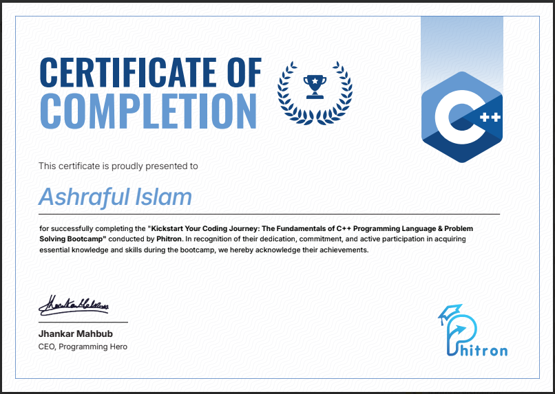

# 15 Days Problem Solving BootCamp is Completed

## 🚀 Bootcamp Highlights

- ✅ Successfully completed the **"Kickstart Your Coding Journey: The Fundamentals of C++ Programming Language & Problem Solving Bootcamp"** by [Phitron](https://phitron.io).
- 📚 Gained foundational and intermediate knowledge of **C++ programming** and **problem-solving techniques**.
- 🧠 Focused on hands-on coding, logical thinking, and algorithmic problem solving.
- 🏆 Earned a **Certificate of Completion** from **Jhankar Mahbub**, CEO of Programming Hero.
- 👨‍💻 Demonstrated consistency, dedication, and active participation throughout the 15-day bootcamp.
- 💪 Strengthened readiness for **competitive programming** and **software development** with structured learning.

